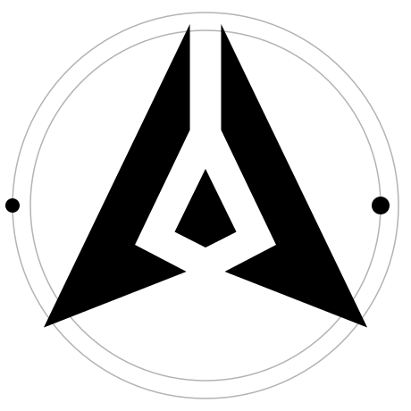

# GenLayer Spinner

A loading spinner built from the GenLayer mark itself. The mark becomes a
vessel: a wave surface rises through it and drains back, while two hairline
rings turn behind it in opposite directions.

Submitted by **moltaphet** to the **Design the GenLayer Spinner** mission on the
GenLayer Portal (14–21 August 2026).

**[Live demo →](https://moltaphet.github.io/genlayer-spinner/)**

---

## What's here

| Path | What it is |
| --- | --- |
| `dist/genlayer-spinner.svg` | The full spinner — fill plus two orbits. Use at 40px and up. |
| `dist/genlayer-spinner-compact.svg` | Fill only, no rings. Use at 24–40px. |
| `src/GenLayerSpinner.jsx` | React component, supports determinate progress. |
| `src/spinner.css` | Stylesheet for the component. |
| `alternates/` | Three earlier motion directions, kept for reference. |
| `index.html` | The bench used to tune this — live sliders for every timing. |

---

## Using it

**As a file.** Drop the SVG in and point an `` at it. The animation is
embedded, so nothing else is needed:

```html

```

**Inline, so it takes your colour.** The mark is filled with `currentColor`.
Inline the SVG and it inherits from whatever `color` is in effect — one file
covers light and dark backgrounds:

```html
<div style="color: #0e0e10">
  <!-- paste the contents of dist/genlayer-spinner.svg here -->
</div>
```

**In React:**

```jsx
import GenLayerSpinner from "./src/GenLayerSpinner";
import "./src/spinner.css";

<GenLayerSpinner size={48} />                 // endless loop
<GenLayerSpinner size={24} orbits={false} />  // small sizes
<GenLayerSpinner size={64} progress={0.62} /> // determinate, 62%
```

### Component options

| Prop | Default | Notes |
| --- | --- | --- |
| `size` | `48` | Rendered size in px. |
| `orbits` | `true` | Turn off below ~40px, where the rings fall under a pixel. |
| `progress` | — | `0`–`1`. Pass it and the loop stops; the level tracks the value. |
| `label` | `"Loading"` | Accessible name. Pass `""` for a decorative spinner. |

### Tuning

Every timing is a CSS custom property, so an instance can be adjusted without
touching the component:

```css
.my-slow-spinner {
  --gls-tide: 5s;      /* rise and drain    */
  --gls-spin: 4s;      /* orbit speed       */
  --gls-empty: 0.24;   /* unfilled opacity  */
  --gls-track: 0.15;   /* ring opacity      */
}
```

---

## How it's built

**The mark is exact, not traced.** The available logo file was a `potrace`
auto-trace of a raster image: 180+ sub-paths, hardcoded black fill, no
structure to animate. It was rebuilt as three polygons — **14 vertices total**,
mirrored to be mathematically symmetrical about the vertical axis. Measured
against the source bitmap it scores **96.4% IoU**, with the remainder being the
original's one-pixel anti-aliased edge.

```
left blade   M182.5 33 L19 372.5 L178.5 310 L121 280 L182.5 151.5 Z
right blade  M217.5 33 L217.5 151.5 L279 280 L221.5 310 L381 372.5 Z
core         M200 195 L165.5 265.5 L200 283 L234.5 265.5 Z
```

**The loop has no seam.** The level's first and last frames share the same
position *and* the same velocity — the easing brings it to rest at both ends —
so there is no point where the eye can catch a restart. The wave path is 1400
units wide against a 372-unit mark, which means a full wavelength of horizontal
travel never uncovers an edge.

**It survives being small.** The unfilled mark stays at 18% opacity rather than
disappearing, so the silhouette is present in every frame. The rings use
`vector-effect: non-scaling-stroke`; without it a 1.5-unit stroke inside a
460-unit viewBox renders at 0.08px on a 24px icon and vanishes.

**Rotation is around the area centroid** at `(200, 236)`, not the bounding-box
centre. A triangle rotated about its bbox centre visibly wobbles.

**Counter-rotation at a 1:1.5 ratio** means the two dots never return to the
same arrangement, so a long wait doesn't start to feel repetitive.

---

## Accessibility

- `prefers-reduced-motion` slows the tide to 7s and stops the horizontal wave
  entirely. It does not stop the animation — a loading indicator that holds
  still stops telling the truth.
- The SVG carries `role="img"` and an accessible name. Pass `label=""` when the
  spinner sits next to text that already says what's loading.

---

## Browser support

`clip-path`, CSS transforms on SVG elements, and `vector-effect` are supported
in all current browsers. `offset-path` is not used. There is no JavaScript in
the SVG files.

---

## Licence

Code is MIT — see [LICENSE](LICENSE).

The GenLayer triangular mark is GenLayer's property and is not relicensed here.
# genlayer-spinner
